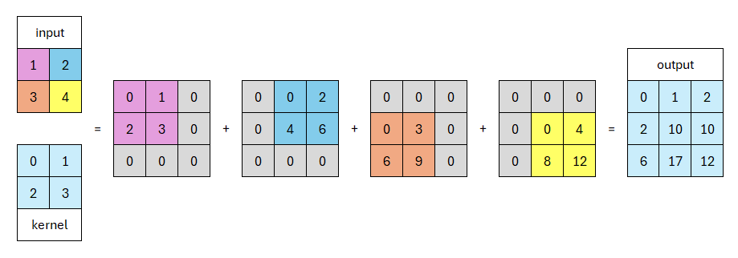

## **Camadas de convolução**

Uma camada de convolução é o componente onde ocorre grande parte da computação propriamente dita. Como o próprio nome sugere, essa é a camada onde irão ocorrer as tão conhecidas **convoluções**, que são processos em que um *kernel* (uma matrix, no nosso modelo, de tamanho 4x4) percorre os campos receptivos de uma imagem, gerando um output com altura e largura menores que a imagem original.

Durante uma convolução, existem alguns parâmetros que podemos alterar para que alcancemos o resultado que desejamos e que usamos em nosso modelo, sendo eles:

1. ***Padding***: parâmetro que cria uma espécie de "moldura" de zeros que é colocada em volta da entrada. Existem 3 tipos de padding: válido, igual ou completo. Utilizamos em nosso modelo o padding completo, de tamanho 1.

2. ***Stride***: é o passo no qual o *kernel* percorrerá a imagem. Quanto maior o valor do passo, menor será o output. Por exemplo, no nosso modelo, utilizamos um passo de 2, para que o output seja menor que a imagem original.

3. ***Dilation***: processo que faz com que o campo receptivo seja aumentado inserindo espaçamentos entre os *pixels* do *kernel*. Assim, da mesma maneira que um *kernel* de 5x5 com dilatação 1 possui 25 pesos, um *kernel* de 3x3 com dilatação 2 possui 9 pesos, ou seja, diminuímos a quantidade de parâmetros e garantimos que seja capturada a mesma quantidade de informação.

As camadas de convolução são utilizadas para transformar uma entrada em valores numéricos, que serão interpretados durante o processo de treinamento da rede neural.

??? example "Exemplo: Convolução"
    Esse conceito pode ser aplicado em Python, como demonstrado abaixo:

    === "Sem dilatação"

        ```python
        from torch import nn

        # ... código acima
        # inicialização

        # Encoder
        self.conv1 = nn.Conv2d(
            1 + self.emb_size, 32, kernel_size=4, stride=2, padding=1
        )
        # ... 

        # ... código abaixo
        ```

    === "Com dilatação"

        ```python 
        from torch import nn

        # inicialização

        # Encoder
        self.conv1 = nn.Conv2d(1 + self.emb_size, 32, kernel_size=4, stride=2, padding=1)
        # até n camadas

        # Dilation
        self.dilat1 = nn.Conv2d(256, 256, kernel_size=4, stride=1, padding=3, dilation=2)
        # até n camadas 

        # ... código abaixo
        ```

!!! info "Embedding por categorias"
    Em relação à primeira camada de convolução, para ambas as situações mostradas anteriormente, explicaremos com mais detalhes em outra seção sobre a categorização das imagens.

## **Camadas de convolução transpostas**

Uma vez que reduzimos as dimensões espaciais da nossa amostra através de convoluções, precisamos de uma ferramenta para voltar ao estado inicial da imagem, que é o objetivo de nossa modelagem.

A convolução transposta funciona de forma que, quando temos uma entrada de dimensões $n_h \times n_w$ e um *kernel* de dimensões $k_h \times k_w$, utilizando um passo de 1 (`stride = 1`), o *kernel* percorrerá um total de $n_h n_w$ vezes, produzindo esse mesmo valor de resultados intermediários, sendo que cada um possui dimensões de $(n_h + k_h - 1) \times (n_w + k_w - 1)$.



Dessa forma, conseguimos recuperar a imagem aumentando sua resolução a cada iteração. Considerando que existem $n$ camadas convolucionais, serão feitas $n$ camadas convolucionais transpostas para recuperar a imagem anteriormente reduzida para treinamento, sendo que na última iteração, obtemos os dois canais de cor desejados, *A* e *B*, que junto à camada *L* inicial, compõem a imagem.

## **Batch normalization**

A normalização em lotes (*batch normalization*) surgiu com o propósito de remediar o problema de mudança de covariável interna (em inglês, *internal covariant shift problem*). Esse problema é causado pela variação da distribuição dos parâmetros das entradas, que pode dificultar na convergência do modelo, uma vez que torna o processo de treinamento mais lento do que deveria ser.

Quando é feita a normalização em mini-lotes (*mini-batches*), isto é, quando a média é ajustada para 0 e a variância para 1, são utilizados dois novos parâmetros, o deslocamento e a escala, que servem para otimizar a normalização para as ativações. Dessa forma, o processo de aprendizado da rede neural é estabilizado, reduzindo a mudança de covariável interna, garantindo consistência entre as camadas do modelo.

??? example "Exemplo: Batch Normalization"
    Um exemplo de uso dessa ferramenta, em Python, é mostrado abaixo:

    ```py
    from torch import nn

    # ... código acima

    # entre os outputs das camadas
    self.conv2 = nn.Conv2d(32, 64, kernel_size=4, stride=2, padding=1)

    # ... código abaixo
    ```

## **Referências**

1. [What are convolutional neural networks?](https://www.ibm.com/topics/convolutional-neural-networks)
2. [Dilated Convolution](https://www.geeksforgeeks.org/dilated-convolution/)
3. [14.10. Transposed Convolution - Basic Operation](https://d2l.ai/chapter_computer-vision/transposed-conv.html)
4. [What is Batch Normalization In Deep Learning?](https://www.geeksforgeeks.org/what-is-batch-normalization-in-deep-learning/)
5. [Internal Covariant Shift Problem in Deep Learning](https://www.geeksforgeeks.org/internal-covariant-shift-problem-in-deep-learning/)