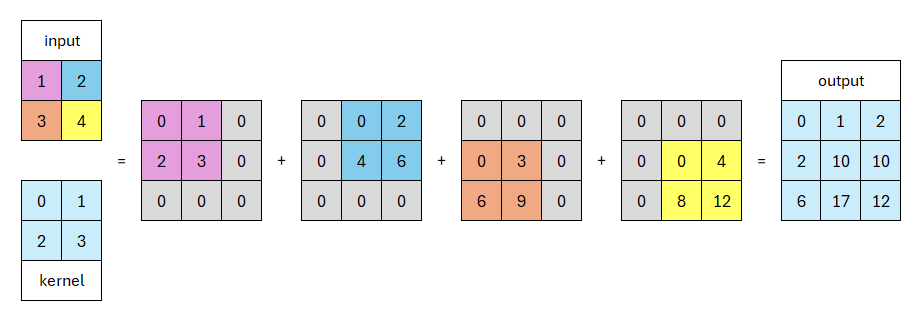

# **Tipos de Convoluções**
___
## **Camada de Convolução**

Convoluções são processos em que um *kernel* (uma matriz de tamanho $n \times m$) percorre os campos receptivos de uma imagem, gerando um output com altura e largura menores que a imagem original.

Durante uma convolução, existem alguns parâmetros que podemos alterar para que alcancemos o resultado que desejamos e que usamos em nosso modelo, sendo eles:

1. ***Padding***: parâmetro que cria uma espécie de "moldura" de zeros que é colocada em volta da entrada. Existem 3 tipos de padding: válido, igual ou completo. Utilizamos em nosso modelo o padding completo, de tamanho 1.

2. ***Stride***: é o passo no qual o *kernel* percorrerá a imagem. Quanto maior o valor do passo, menor será o output. Por exemplo, no nosso modelo, utilizamos um passo de 2, para que o output seja menor que a imagem original. Nesse tutorial, quando quisermos alterar o tamanho da imagem usaremos `stride=2`, assim diminuindo as dimensões da imagem pela metade ou dobrando-as.

3. ***Dilation***: processo que faz com que o campo receptivo seja aumentado inserindo espaçamentos entre os *pixels* do *kernel*. Assim, da mesma maneira que um *kernel* de 5x5 com dilatação 1 possui 25 pesos, um *kernel* de 3x3 com dilatação 2 possui 9 pesos, ou seja, diminuímos a quantidade de parâmetros e garantimos que seja capturada a mesma quantidade de informação.

As camadas de convolução são utilizadas para transformar uma entrada em valores numéricos, que serão interpretados durante o processo de treinamento da rede neural.

!!! example "Código: Convoluções"
    Esse conceito pode ser aplicado em Python, como demonstrado abaixo:

    === "Sem Dilatação"
        No código, para declarar uma camada de **convolução** é necessário especificar, nessa ordem, a quantidade de layers de entrada, quantidade de layers de saída, tamanho do kernel, tamanho do passo (*stride*) (padrão=1) e tamanho da moldura (*padding*) (padrão=0). Nos modelos construidos nesse tutorial utilizaremos `kernel_size=4` e `padding=1`.

        ```python
        from torch import nn

        conv = nn.Conv2d(1, 32, kernel_size=4, stride=2, padding=1)
        ```

    === "Com Dilatação"
        Já para declarar uma camada de **dilatação** é necessário especificar, além dos parâmetros da convolução normal: a quantidade de pesos de dilatação (padrão=1). Nos modelos construídos nesse tutorial utilizaremos `dilation=2` com `padding=3`.
        ```python 
        from torch import nn

        dilat = nn.Conv2d(256, 256, kernel_size=4, stride=1, padding=3, dilation=2)
        ```

___
## **Camada de Convolução Transposta**

Uma vez que reduzimos as dimensões espaciais da nossa amostra através de convoluções, precisamos de uma ferramenta para voltar ao estado inicial da imagem, que é o objetivo de nossa modelagem.

A convolução transposta funciona de forma que, quando temos uma entrada de dimensões $n_h \times n_w$ e um *kernel* de dimensões $k_h \times k_w$, utilizando um passo de 1 (`stride = 1`), o *kernel* percorrerá um total de $n_h n_w$ vezes, produzindo esse mesmo valor de resultados intermediários, sendo que cada um possui dimensões de $(n_h + k_h - 1) \times (n_w + k_w - 1)$.



Dessa forma, conseguimos recuperar a imagem aumentando sua resolução a cada iteração. Considerando que existem $n$ camadas convolucionais, serão feitas $n$ camadas convolucionais transpostas para recuperar a imagem anteriormente reduzida para treinamento, sendo que na última iteração, obtemos os dois canais de cor desejados, *A* e *B*, que junto à camada *L* inicial, compõem a imagem.

Sua sintaxe no código é muito parecida coma a da camada de **convolução**, possuindo os mesmos parâmetros:
```python title="Código: Convolução transposta"
from torch import nn

tconv = nn.ConvTranspose2d(32, 2, kernel_size=4, stride=2, padding=1)
```

___
## **Referências**

1. [What are convolutional neural networks?](https://www.ibm.com/topics/convolutional-neural-networks)
2. [Dilated Convolution](https://www.geeksforgeeks.org/dilated-convolution/)
3. [Transposed Convolution - Basic Operation](https://d2l.ai/chapter_computer-vision/transposed-conv.html)