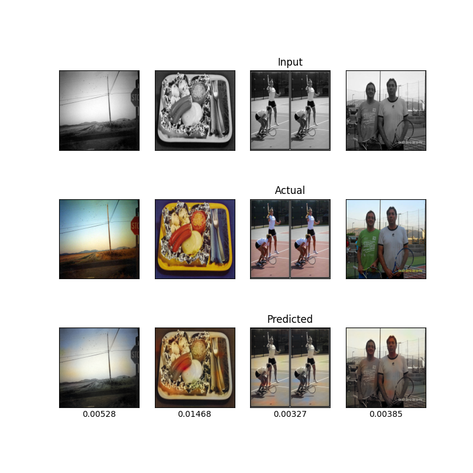

# TCNN - Tagged Colorization Neural Network

Esse é o código base de um modelo de colorização de imagens classificadas. 

O modelo recebe uma imagem em preto e branco (escala de cinza) e, utilizando o `tema da imagem` e um `tema objetivo`, tentará colorir essa imagem a partir desses temas.

A implemntação foi feita utilizando o [PyTorch](https://github.com/pytorch/pytorch) e o treinamento foi feito utilizando o conjunto de treinamento do dataset [Image Colorization Dataset](https://www.kaggle.com/datasets/aayush9753/image-colorization-dataset) e a classificação manual das imagens feita por nós, disponivel em: [Categories](https://alinsperedu-my.sharepoint.com/:x:/g/personal/rafaeldbo_al_insper_edu_br/EeRQzARO6MVGhUKujV0i_WMBwYfJvLsDrpNNzvF-rBG-KA?e=WDF7Ng). O código foi inspirado no código [cnn-image-colorization](https://github.com/gkamtzir/cnn-image-colorization) de George Kamtziridis e foi feito sob a orientação do Professor Fabio Ayres do Insper.

As seguintes categorias foram usadas na classificação das imagens: `pessoas`, `alimentos`, `animais`, `veiculos`, `ambientes externos`, `ambientes internos` e `objetos`.

## Requisitos

Para instalar as bibliotecas python necessárias, utilize o comando (preferencialmente, em um ambiente virtual `venv`):
```
python -m pip install -r requirements.txt -y
``` 
Além disso, para treinar o modelo, também é necessário colocar os conjuntos de imagens presentes no dataset [Image Colorization Dataset](https://www.kaggle.com/datasets/aayush9753/image-colorization-dataset) e o arquivo de categorias [Categories](https://alinsperedu-my.sharepoint.com/:x:/g/personal/rafaeldbo_al_insper_edu_br/EeRQzARO6MVGhUKujV0i_WMBwYfJvLsDrpNNzvF-rBG-KA?e=WDF7Ng) na pasta `code/data`.

## Resultados


### Desenvolvedores
* Beatriz Rodrigues de Freitas
* Carlos Eduardo Porciuncula Yamada
* Rafael Dourado Bastos de Oliveira

### Orientação
* Fábio José Ayres

### Referências
1) [Building an Image Colorization Neural Network](https://medium.com/@geokam/building-an-image-colorization-neural-network-part-4-implementation-7e8bb74616c)

2) [cnn-image-colorization](https://github.com/gkamtzir/cnn-image-colorization)