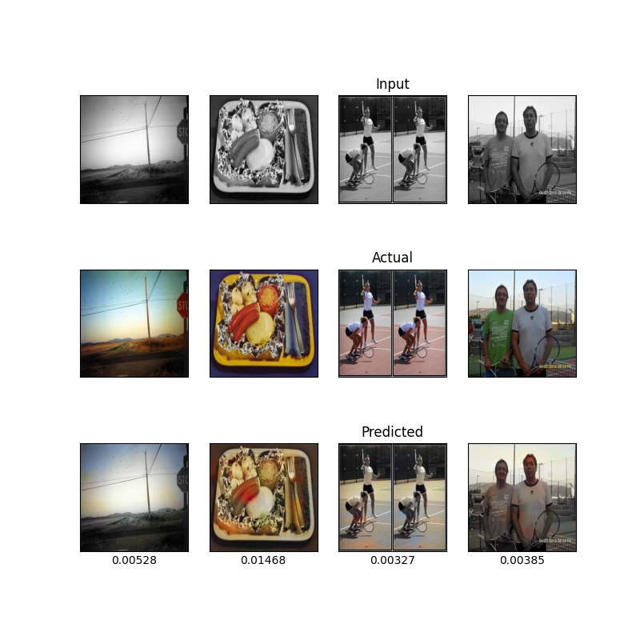

O modelo será testado utilizando 739 imagens diversas que foram classificadas nas categorias existentes (comida, pessoas, etc.).

Foi utilizado um `batch_size` de 4 imagens e um modelo de CNN com 4 camadas de convolução, utilizando ReLU sobre um processo de *batch normalization* (*encoder*), duas camadas de convolução dilatada seguidas de 4 camadas de convolução transposta, sendo que a última possui 2 canais de cor (vide explicação **Camadas de convolução transposta**). Seus parâmetros são:

```py
params = {
    'kernel_size' = 4,
    'stride' = 1, 
    'padding' = 3, 
    'dilation' = 2
}
```

Os resultados do teste são mostrados pela imagem a seguir:

