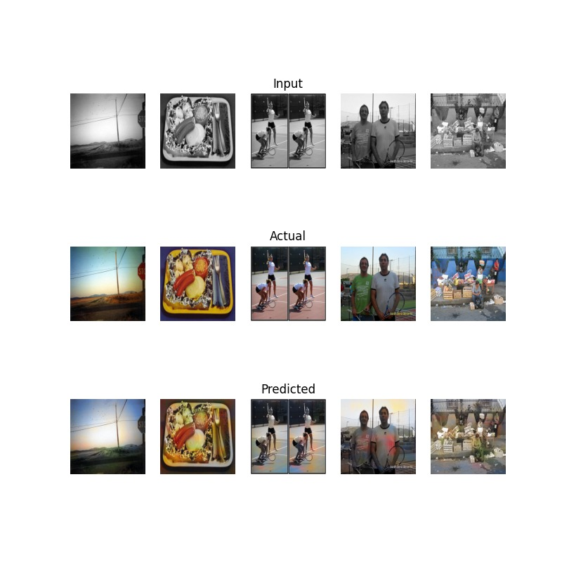
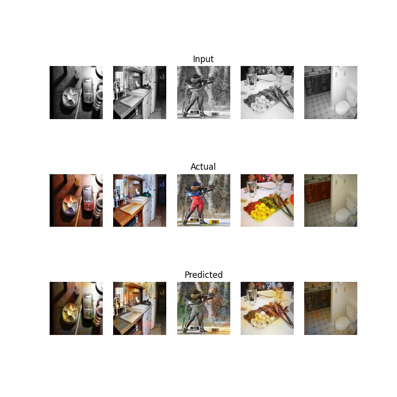
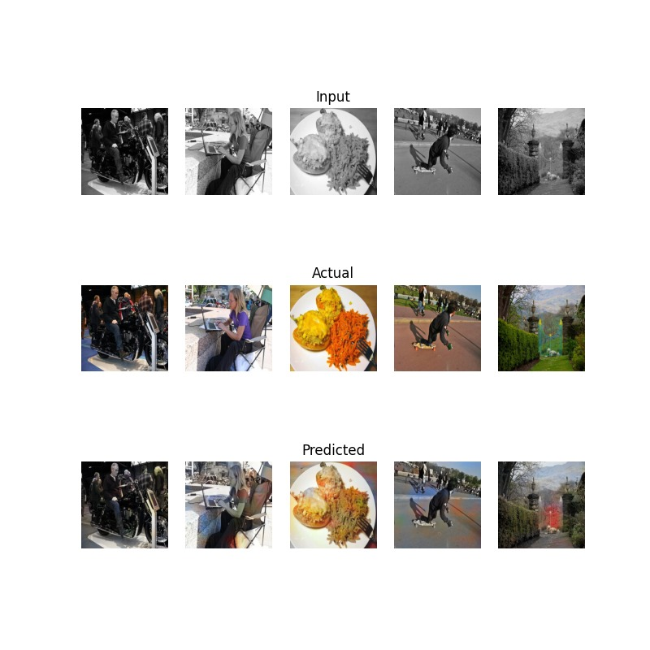
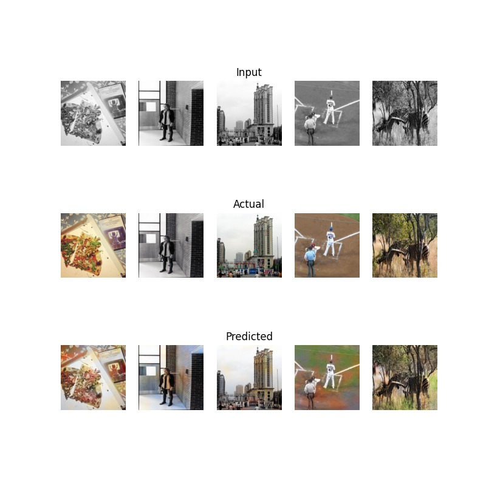

# Testando o Modelo

Após o treinamento do modelo, devemos testar nosso modelo em um conjunto de imagem completamente novo para sabermos se ele é capaz de generalizar bem a colorização para imagens que ele nunca viu antes. Para isso, utilizaremos o conjunto de teste que foi separado anteriormente.

Nosso modelo treinado com `100 Epochs`, `5000 imagens` e um **learning rate** de `0,001` foi capaz de atingir um `MSE` de $77,71$ no conjunto de treino e $199,73$ no conjunto de teste. O tempo de treinamento foi de aproximadamente `1h 45min` utilizando uma **NVIDIA RTX 4070**.

