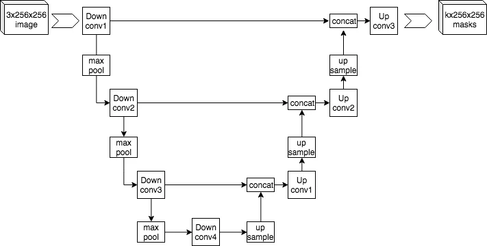

# **U-Net Layout**

`U-Net` é um tipo especial de Rede Neural Convolucional (**CNN**) criada especificamente para o uso em imagens. Ela é composta de duas etapas, uma de Encoding e outra de **Decoding**, semelhante a estrutura do padrão do Autoencoder, porém criando um formato de **U** (por isso U-Net) e diversas **conexões atalho**. Assim como no Autoecoder, a estrutura será divididas em diferentes níveis, e a etapa de Encoding normalmente possui o mesmo número de níveis que a etapa de **Decoding**, as vezes possuindo, também, um ou mais níveis de transição.


/// caption
Referência: [Example Arquiteture of U-Net](https://commons.wikimedia.org/wiki/File:Example_architecture_of_U-Net_for_producing_k_256-by-256_image_masks_for_a_256-by-256_RGB_image.png)
///

Na etapa de **Encoding** a imagem irá realizar uma decida passando por meio de seus níveis, em cada nível a imagem terá suas dimensões diminuídas, porém a quantidade de layers aumentada. Já na etapa de **Decoding**, a imagem realizará uma subida e, a cada nível, suas dimensões serão aumentadas e sua quantidade de layers diminuída (seguindo a mesma proporção da etapa de **Encoding**) até chegar nas dimensões originais e a quantidade de layers desejada. 

Além disso, por meio das **conexões atalho**, durante cada nível do **Decoding** haverá a concatenação da imagem atual com a imagem do respectivo nível da etapa de **Encoding**, a imagem com mesmas dimensões e quantidade de layers.

Essas **conexões atalho** são utilizadas para enviar imagens diretamente da etapa de **Encoding** para a etapa de **Decoding** sem que elas precisem passar por todos os níveis. Isso permite que recursos de alto e baixa complexidade sejam preservados e aprendidos, por meio da redução do problema do **desaparecimento de gradientes**, reduzindo, assim, a perda de informações que pode ocorrer durante a etapa de **Encoding**.
___
## **Fowarding**
Antes de construirmos nosso primeiro modelo utilizando os conhecimentos obtidos até aqui precisamos entender um último conceito.

``Forwarding`, `Forward Pass` ou `Propagação Direta` é o processo pelo qual uma rede neural processa uma entrada e produz uma saída. Nele uma entrada passa sequencialmente por cada camada do modelo e, ao fim de todas elas, produz um resultado final.

Iremos implementá-lo nos nossos modelos por meio da definição da função `forward` que será chamada a cada execução do modelo.
___
## **Construindo um Modelo**

Construiremos o código de um modelo simples, porém completo, que utiliza o U-Net Layout.

Nesse modelo teremos dois níveis com  camadas `convolucionais` no **Encoder**, uma camada de `dilatação` no nível de transição, e dois níveis com camadas `convolucionais transpostas` no **Decoder**. Todas as camadas serão seguidas de uma camada de `Normalização em Batches`, menos no ultimo nível do **Decoder**.

``` python title="Declaração das Camadas"
# Encoder
# entrada: (1, w, h) -> saida: (32, w/2, h/2)
conv1 = nn.Conv2d(1, 32, kernel_size=4, stride=2, padding=1) 
conv1_bn = nn.BatchNorm2d(32)

# entrada: (32, w/2, h/2) -> saida: (64, w/4, h/4)
conv2 = nn.Conv2d(32, 64, kernel_size=4, stride=2, padding=1)
conv2_bn = nn.BatchNorm2d(64)

# Nível de Transição
# entrada: (64, w/4, h/4) -> saida: (128, w/8, h/8)
conv3 = nn.Conv2d(64, 128, kernel_size=4, stride=2, padding=1)
conv3_bn = nn.BatchNorm2d(128)

# Decoder
# entrada: (128, w/8, h/8) -> saida: (64, w/4, h/4)
tconv2 = nn.ConvTranspose2d(128, 64, kernel_size=4, stride=2, padding=1)
tconv2_bn = nn.BatchNorm2d(64)

# entrada: (128, w/4, h/4) -> saida: (32, w/2, h/2)
tconv1 = nn.ConvTranspose2d(128, 32, kernel_size=4, stride=2, padding=1)
tconv1_bn = nn.BatchNorm2d(32)

# entrada: (64, w/2, h/2) -> saida: (2, w, h)
tconv0 = nn.ConvTranspose2d(64, 2, kernel_size=4, stride=2, padding=1)

# entrada: (3, w, h) -> saida: (2, w, h)
tconv_out = nn.ConvTranspose2d(3, 2, kernel_size=3, stride=1, padding=1)

```
Observe que a quantidade de layers das imagens que entram no `tconv1` e `tconv0` é o dobro da quantidade de layer que sai da `tconv2` e `tconv1`, respectivamente. Isso ocorre devido a concatenação das imagens que saem dessas camadas com as imagens vindas de suas respectivas **conexões atalho**. 

Além disso, note a presença de uma camada de **convolução transposta** de saída que servirá ajustar a quantidade de layers que ficou diferente do objetivo (duas: A+B) após a concatenação das imagens do nível 0 (imagem em escala de cinza). Por fim, observe também que nos dois últimos níveis do **Decoder** não há à aplicação de camadas de **normalização em batches**. Essa escolha foi tomada devido a baixa efetividade da **normalização em batches** em poucas quantidades de layers.

A decida por cada nível da etapa de **Encoding** consistirá em aplicar a camada **convolucional**, seguida da camada de **normalização em batches** e por fim aplicação da função de ativação **ReLU**. 
``` python title="Função de Forwarding (Encoder)"
gray_conv1 = relu(self.conv1_bn(self.conv1(gray))) # Nível 1
gray_conv2 = relu(self.conv2_bn(self.conv2(gray_conv1))) # Nível 2

gray_conv3 = relu(self.conv3_bn(self.conv3(gray_conv2))) # Nível de Transição
```

Já a subida por cada nível da etapa de **Decoding** consistirá em aplicar a camada **convolucional transposta**, seguida da camada de **normalização em batches**, aplicar a função de ativação **ReLU** e por fim concatenar o resultado com a imagem resultade do respectivo nível da etapa de **Encoding**.
Porém há uma pequena 
``` python title="Função de Forwarding (Decoder)"
gray_tconv2 = relu(self.tconv2_bn(self.tconv2(gray_conv3)))
gray_tconv2 = cat((gray_tconv2, gray_conv2), 1)
gray_tconv1 = relu(self.tconv1(gray_tconv2))
gray_tconv1 = cat((gray_tconv1, gray_conv1), 1)

gray_tconv0 = relu(self.tconv0(gray_tconv1))
gray_tconv0 = cat((gray_tconv0, gray), 1)

output = self.tconv_out(gray_tconv0)
```

???- example "Modelo Completo"
    Para criar um modelo completo e funcional, encapsularemos as duas partes acima em um classe:
    ``` python title="Modelo Completo"
    class UnetModel(nn.Module):
        def __init__(self) -> None:
            super().__init__()

            # Encoder
            self.conv1 = nn.Conv2d(1, 32, kernel_size=4, stride=2, padding=1)
            self.conv1_bn = nn.BatchNorm2d(32)

            self.conv2 = nn.Conv2d(32, 64, kernel_size=4, stride=2, padding=1)
            self.conv2_bn = nn.BatchNorm2d(64)
            
            # Nível de Transição
            self.conv3 = nn.Conv2d(64, 128, kernel_size=4, stride=2, padding=1)
            self.conv3_bn = nn.BatchNorm2d(128)

            # Decoder
            self.tconv2 = nn.ConvTranspose2d(128, 64, kernel_size=4, stride=2, padding=1)
            self.tconv2_bn = nn.BatchNorm2d(64)

            self.tconv1 = nn.ConvTranspose2d(128, 32, kernel_size=4, stride=2, padding=1)
            self.tconv1_bn = nn.BatchNorm2d(32)

            self.tconv0 = nn.ConvTranspose2d(64, 2, kernel_size=4, stride=2, padding=1)
            
            self.tconv_out = nn.ConvTranspose2d(3, 2, kernel_size=3, stride=1, padding=1)

        def forward(self, gray: Tensor) -> Tensor:

            # Encoder
            gray_conv1 = relu(self.conv1_bn(self.conv1(gray)))
            gray_conv2 = relu(self.conv2_bn(self.conv2(gray_conv1)))

            # Nível de Transição
            gray_conv3 = relu(self.conv3_bn(self.conv3(gray_conv2)))
            
            # Decoder
            gray_tconv2 = relu(self.tconv2_bn(self.tconv2(gray_conv3)))
            gray_tconv2 = cat((gray_tconv2, gray_conv2), 1)
            
            gray_tconv1 = relu(self.tconv1(gray_tconv2))
            gray_tconv1 = cat((gray_tconv1, gray_conv1), 1)
            
            gray_tconv0 = relu(self.tconv0(gray_tconv1))
            gray_tconv0 = cat((gray_tconv0, gray), 1)
            
            output = self.tconv_out(gray_tconv0)
            return output
    ```

___
## **Referências:**

1. [A U-Net: A Complete Guide](https://medium.com/@alejandro.itoaramendia/decoding-the-u-net-a-complete-guide-810b1c6d56d8)